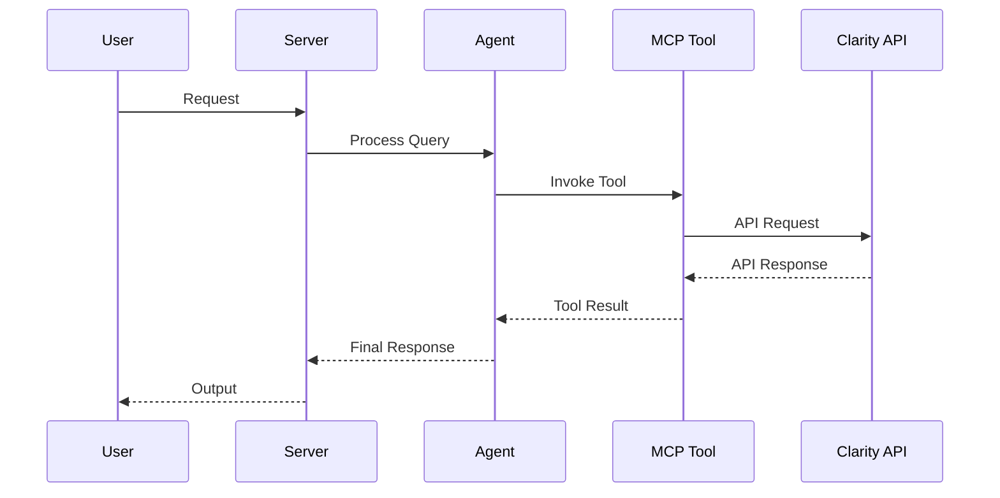

# AGENTS.md

> Claude Code loads this file via `CLAUDE.md` (`@AGENTS.md` import) — the two stay
> in sync. Edit **this** file, not `CLAUDE.md`.

## Tech Stack & Architecture
- Language/Version: Python 3.11+
- Core Libraries: `agent-utilities`, `fastmcp`, `pydantic-ai`, `requests`
- Key principles: Functional patterns, Pydantic for data validation, asynchronous tool execution.
- Architecture (layered, intentionally thin for a single-endpoint connector):
    - `mcp_server.py`: Main MCP server entry point and tool registration.
    - `agent_server.py`: Pydantic AI A2A agent server.
    - `mcp/`: Transport layer — MCP tool registration; tools depend on an
      injected client via `Depends(get_client)`.
    - `services/`: Application-service layer — `InsightsService` wraps the
      injected client with the data-export use case (`CONCEPT:CLA-001`).
    - `api/`: Adapter layer — modular REST client mixins composed into the
      `Api` facade.
    - `clarity_models.py` / `models.py`: Pydantic request/response models.
  > Note: a fuller domain/ports split would be over-engineering for a connector
  > exposing a single Clarity endpoint; the service seam above is the right
  > altitude. See `docs/concepts.md` for the `CONCEPT:CLA-*` registry.

### Architecture Diagram

### Workflow Diagram

## Commands (run these exactly)
# Installation
pip install .[all]

# Quality & Linting (run from project root)
pre-commit run --all-files

# Execution Commands
# clarity-mcp
clarity_api.mcp_server:mcp_server
# clarity-agent
clarity_api.agent_server:agent_server

## Project Structure Quick Reference
- MCP Entry Point → `clarity_api/mcp_server.py`
- Agent Entry Point → `clarity_api/agent_server.py`
- Source Code → `clarity_api/`
- REST client → `clarity_api/api/`
- MCP tools → `clarity_api/mcp/`

## Code Style & Conventions
**Always:**
- Use `agent-utilities` for common patterns (e.g., `create_mcp_server`, `create_agent_server`).
- Define input/output models using Pydantic.
- Include descriptive docstrings for all tools (they are used as tool descriptions for LLMs).
- Check for optional dependencies using `try/except ImportError`.
- Preserve the original `Api`/`get_data_export` contract.

## Dos and Don'ts
**Do:**
- Run `pre-commit` before pushing changes.
- Use existing patterns from `agent-utilities`.
- Keep tools focused and idempotent where possible.

**Don't:**
- Use `cd` commands in scripts; use absolute paths or relative to project root.
- Add new dependencies to `dependencies` in `pyproject.toml` without checking `optional-dependencies` first.
- Hardcode secrets; use environment variables or `.env` files.

## Safety & Boundaries
**Always do:**
- Run lint/test via `pre-commit`.
- Use `agent-utilities` base classes.

**Never do:**
- Commit `.env` files or secrets.
- Modify `agent-utilities` or `universal-skills` files from within this package.

## ⛔ Keep the Repository Root Pristine — No Scratch / Temp / Debug Files
The repository ROOT must contain only canonical project files (packaging, config,
docs, lockfiles). Never write one-off/debug/migration scripts, logs, data dumps,
or build artifacts anywhere in the repo. Tests go in `tests/` (pytest). Scratch
work goes in `~/workspace/scratch/`; command output in `~/workspace/reports/`.
