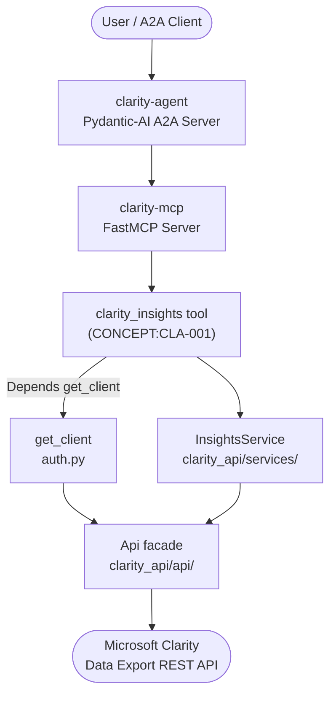

# Microsoft Clarity API


*Version: 2.0.1*

**Microsoft Clarity API + MCP Server + A2A Agent**

`clarity-api` is a typed, action-routed connector for the
[Microsoft Clarity Data Export API](https://learn.microsoft.com/en-us/clarity/setup-and-installation/clarity-data-export-api),
built on [`agent-utilities`](https://github.com/Knuckles-Team/agent-utilities). It
ships a Python `Api` client, a [FastMCP](https://github.com/jlowin/fastmcp) MCP server
(`clarity-mcp`), and an optional Pydantic-AI A2A agent server (`clarity-agent`).

It works with the dashboard data — structured over a specified date range and broken
down by up to three dimensions.

This repository is actively maintained — contributions are welcome!

## Table of Contents

- [Architecture](#architecture)
- [Key Features](#key-features)
- [Available MCP Tools](#available-mcp-tools)
- [Dynamic Tool Selection](#dynamic-tool-selection)
- [Environment Variables](#environment-variables)
- [Configuration](#configuration)
- [Agent](#agent)
- [Usage (Python client)](#usage-python-client)
- [Security & Governance](#security--governance)
- [Installation](#installation)
- [Documentation](#documentation)
- [Contributing](#contributing)

## Architecture

`clarity-api` follows the standard agent-package layering: a typed REST client at
the bottom, an action-routed MCP tool layer in the middle, and an optional
Pydantic-AI A2A agent server on top. The MCP tool depends on an injected client
via `Depends(get_client)`, which resolves credentials (OIDC delegation or a fixed
`CLARITY_TOKEN`) before talking to the Microsoft Clarity REST API.



| Layer | Module | Responsibility |
|-------|--------|----------------|
| Agent | `clarity_api/agent_server.py` | Pydantic-AI A2A server, AG-UI web interface |
| Tooling | `clarity_api/mcp/`, `clarity_api/mcp_server.py` | Action-routed MCP tool registration |
| Service | `clarity_api/services/` | `InsightsService` — dependency-injected data-export use case |
| Auth seam | `clarity_api/auth.py` | `get_client` dependency: OIDC delegation / fixed token |
| Client | `clarity_api/api/` | `ClarityApiBase` + `ClarityApiInsights` mixins composed into `Api` |
| Models | `clarity_api/clarity_models.py` | Pydantic request/response validation |

## Key Features

- **Typed Python client** — `clarity_api.api_client.Api`, composed from modular per-domain
  mixins in `clarity_api/api/`, validating credentials against `GET /projects`.
- **Action-routed MCP tool** — `clarity_insights` (`CONCEPT:CLA-001`) consolidates the
  Data Export surface to minimize LLM token overhead.
- **A2A agent server** — `clarity-agent` auto-discovers the MCP tools and exposes an
  AG-UI web interface.
- **Enterprise-ready** — inherits OIDC auth, OpenTelemetry, audit logging, prompt-injection
  defense, and guardrails from `agent-utilities`.

## Available MCP Tools

_Auto-generated — do not edit (synced by the `mcp-readme-table` pre-commit hook)._

<!-- MCP-TOOLS-TABLE:START -->

#### Condensed action-routed tools (default — `MCP_TOOL_MODE=condensed`)

| MCP Tool | Toggle Env Var | Description |
|----------|----------------|-------------|
| `clarity_insights` | `INSIGHTSTOOL` | Retrieve Microsoft Clarity dashboard data insights for a project. |

#### Verbose 1:1 API-mapped tools (`MCP_TOOL_MODE=verbose` or `both`)

<details>
<summary>1 per-operation tools — one per public API method (click to expand)</summary>

| MCP Tool | Toggle Env Var | Description |
|----------|----------------|-------------|
| `clarity_get_data_export` | `CLARITY_API_INSIGHTSTOOL` | Retrieve dashboard data insights for a project. |

</details>

_1 action-routed tool(s) (default) · 1 verbose 1:1 tool(s). Each is enabled unless its `<DOMAIN>TOOL` toggle is set false; `MCP_TOOL_MODE` selects the surface (`condensed` default · `verbose` 1:1 · `both`). Auto-generated — do not edit._
<!-- MCP-TOOLS-TABLE:END -->

### Parameters
- `number_of_days` (1, 2, or 3): last 24, 48, or 72 hours.
- `dimension_1`, `dimension_2`, `dimension_3`: breakdown dimensions.

#### Dimension Options
`Browser`, `Device`, `Country`, `OS`, `Source`, `Medium`, `Campaign`, `Channel`, `URL`.

## Dynamic Tool Selection

Each tool domain is gated behind an env toggle so deployments can trim their surface:

| Toggle | Default | Domain |
|--------|---------|--------|
| `INSIGHTSTOOL` | `True` | `clarity_insights` |

## Environment Variables

<!-- ENV-VARS-TABLE:START -->

#### Package environment variables

| Variable | Example | Description |
|----------|---------|-------------|
| `HOST` | `0.0.0.0` |  |
| `PORT` | `8000` |  |
| `TRANSPORT` | `stdio` | options: stdio, streamable-http, sse |
| `FASTMCP_LOG_LEVEL` | `ERROR` | FastMCP log verbosity |
| `NO_COLOR` | `1` |  |
| `TERM` | `dumb` |  |
| `ENABLE_OTEL` | `True` |  |
| `OTEL_EXPORTER_OTLP_ENDPOINT` | `http://localhost:8080/api/public/otel` |  |
| `OTEL_EXPORTER_OTLP_PUBLIC_KEY` | `pk-...` |  |
| `OTEL_EXPORTER_OTLP_SECRET_KEY` | `sk-...` |  |
| `OTEL_EXPORTER_OTLP_PROTOCOL` | `http/protobuf` |  |
| `EUNOMIA_TYPE` | `none` | options: none, embedded, remote |
| `EUNOMIA_POLICY_FILE` | `mcp_policies.json` |  |
| `EUNOMIA_REMOTE_URL` | `http://eunomia-server:8000` |  |
| `CLARITY_URL` | `https://www.clarity.ms` |  |
| `CLARITY_TOKEN` | `your_clarity_token_here` |  |
| `CLARITY_SSL_VERIFY` | `True` |  |
| `INSIGHTSTOOL` | `True` |  |

#### Inherited agent-utilities variables (apply to every connector)

| Variable | Example | Description |
|----------|---------|-------------|
| `MCP_TOOL_MODE` | `condensed` | Tool surface: `condensed` | `verbose` | `both` |
| `MCP_ENABLED_TOOLS` | — | Comma-separated tool allow-list |
| `MCP_DISABLED_TOOLS` | — | Comma-separated tool deny-list |
| `MCP_ENABLED_TAGS` | — | Comma-separated tag allow-list |
| `MCP_DISABLED_TAGS` | — | Comma-separated tag deny-list |
| `MCP_CLIENT_AUTH` | — | Outbound MCP auth (`oidc-client-credentials` for fleet calls) |
| `OIDC_CLIENT_ID` | — | OIDC client id (service-account auth) |
| `OIDC_CLIENT_SECRET` | — | OIDC client secret (service-account auth) |
| `DEBUG` | `False` | Verbose logging |
| `PYTHONUNBUFFERED` | `1` | Unbuffered stdout (recommended in containers) |
| `MCP_URL` | `http://localhost:8000/mcp` | URL of the MCP server the agent connects to |
| `PROVIDER` | `openai` | LLM provider for the agent |
| `MODEL_ID` | `gpt-4o` | Model id for the agent |
| `ENABLE_WEB_UI` | `True` | Serve the AG-UI web interface |

_18 package + 14 inherited variable(s). Auto-generated from `.env.example` + the shared agent-utilities set — do not edit._
<!-- ENV-VARS-TABLE:END -->


All runtime configuration is supplied via environment variables (or a `.env`
file — see [`.env.example`](.env.example)). Never commit real tokens.

### Clarity credentials

| Variable | Default | Description |
|----------|---------|-------------|
| `CLARITY_URL` | `https://www.clarity.ms` | Base URL of the Microsoft Clarity instance. |
| `CLARITY_TOKEN` | _(none)_ | Bearer API token generated in the Clarity project settings. Required unless OIDC delegation is enabled. |
| `CLARITY_SSL_VERIFY` | `True` | Whether to verify TLS certificates when calling the Clarity API. |

### MCP server / transport

| Variable | Default | Description |
|----------|---------|-------------|
| `TRANSPORT` | `stdio` | MCP transport: `stdio`, `streamable-http`, or `sse`. |
| `HOST` | `0.0.0.0` | Bind host for HTTP transports. |
| `PORT` | `8000` | Bind port for HTTP transports. |
| `AUTH_TYPE` | `none` | MCP server auth scheme inherited from `agent-utilities` (e.g. `none`, `oidc`). |
| `FASTMCP_LOG_LEVEL` | `ERROR` | FastMCP log verbosity. Set to `ERROR` at startup to suppress log spam. |
| `INSIGHTSTOOL` | `True` | Toggle registration of the `clarity_insights` tool (see [Dynamic Tool Selection](#dynamic-tool-selection)). |

### Telemetry & access governance

| Variable | Default | Description |
|----------|---------|-------------|
| `ENABLE_OTEL` | `True` | Enable OpenTelemetry export of traces/metrics. |
| `EUNOMIA_TYPE` | `none` | Eunomia authorization mode: `none`, `embedded`, or `remote`. |
| `EUNOMIA_POLICY_FILE` | `mcp_policies.json` | Path to the local Eunomia policy file (embedded mode). |

### Build / terminal (set automatically — usually no action needed)

| Variable | Default | Description |
|----------|---------|-------------|
| `UV_COMPILE_BYTECODE` | `1` | Set in the Docker image to precompile bytecode for faster cold starts. |
| `NO_COLOR` / `TERM` | `1` / `dumb` | Terminal-control variables set at MCP startup to keep stdio transport output machine-clean. Not app configuration — listed for completeness. |

## Configuration

> **Install the slim `[mcp]` extra.** The examples below install
> `clarity-api[mcp]` — the MCP-server extra that pulls only the FastMCP /
> FastAPI tooling (`agent-utilities[mcp]`). It deliberately **excludes** the heavy
> agent runtime (the epistemic-graph engine, `pydantic-ai`, `dspy`, `llama-index`,
> `tree-sitter`), so `uvx`/container installs are dramatically smaller and faster.
> Use the full `[agent]` extra only when you need the integrated Pydantic AI agent
> (see [Installation](#installation)).

### stdio (local agent integration)

```json
{
  "mcpServers": {
    "clarity-api": {
      "command": "uv",
      "args": ["run", "--with", "clarity-api[mcp]", "clarity-mcp"],
      "env": {
        "CLARITY_URL": "https://www.clarity.ms",
        "CLARITY_TOKEN": "<YOUR_CLARITY_TOKEN>"
      }
    }
  }
}
```

### Streamable HTTP

```bash
export CLARITY_URL=https://www.clarity.ms
export CLARITY_TOKEN=<your-clarity-token>
clarity-mcp --transport streamable-http --host 0.0.0.0 --port 8000
```

### Docker

```bash
docker pull knucklessg1/clarity-api:mcp
docker compose -f docker/mcp.compose.yml up -d
```

> The `:mcp` tag is the **slim MCP-server image** (built from
> `docker/Dockerfile --target mcp`, installing `clarity-api[mcp]`). The default
> `:latest` tag is the **full agent image** (`--target agent`, `clarity-api[agent]`)
> which also bundles the Pydantic AI agent and the epistemic-graph engine — use it
> when you run `clarity-agent` (the agent), not just the MCP server. See
> [Container images](#container-images-mcp-vs-agent).

<!-- BEGIN GENERATED: additional-deployment-options -->
### Additional Deployment Options

`clarity-api` can also run as a **local container** (Docker / Podman / `uv`) or be
consumed from a **remote deployment**. The
[Deployment guide](https://knuckles-team.github.io/clarity-api/deployment/) has full, copy-paste
`mcp_config.json` for all four transports — **stdio**, **streamable-http**,
**local container / uv**, and **remote URL**:

- **Local container / uv** — launch the server from `mcp_config.json` via `uvx`,
  `docker run`, or `podman run`, or point at a local streamable-http container by `url`.
- **Remote URL** — connect to a server deployed behind Caddy at
  `http://clarity-mcp.arpa/mcp` using the `"url"` key.
<!-- END GENERATED: additional-deployment-options -->

## Agent

The `clarity-agent` entry point (`clarity_api/agent_server.py`) starts a
Pydantic-AI A2A server that auto-discovers the MCP tools and exposes an AG-UI web
interface.

### Run locally

```bash
clarity-agent --web --provider openai --model-id gpt-4o
```

The agent reads its identity from `clarity_api/agent_data/IDENTITY.md` and discovers
tools via `mcp_config.json`.

### Deploy with Docker Compose

`docker/agent.compose.yml` runs the MCP server and the agent server side by side;
the agent connects to the MCP server over `MCP_URL`:

```yaml
services:
  clarity-api-mcp:
    image: knucklessg1/clarity-api:mcp
    restart: always
    env_file: [ ../.env ]
    environment:
      - HOST=0.0.0.0
      - PORT=8000
      - TRANSPORT=streamable-http
    ports: [ "8000:8000" ]

  clarity-api-agent:
    image: knucklessg1/clarity-api:latest
    restart: always
    depends_on: [ clarity-api-mcp ]
    command: [ "clarity-agent" ]
    env_file: [ ../.env ]
    environment:
      - HOST=0.0.0.0
      - PORT=9017
      - MCP_URL=http://clarity-api-mcp:8000/mcp
      - PROVIDER=${PROVIDER:-openai}
      - MODEL_ID=${MODEL_ID:-gpt-4o}
      - ENABLE_WEB_UI=True
      - ENABLE_OTEL=True
    ports: [ "9017:9017" ]
```

```bash
docker compose -f docker/agent.compose.yml up -d
```

## Usage (Python client)

```python
#!/usr/bin/python
# coding: utf-8
import clarity_api

token = "<TOKEN>"
url = "https://www.clarity.ms"
client = clarity_api.Api(url=url, token=token)

response = client.get_data_export(number_of_days=2, dimension_1="OS", dimension_2="Channel")
print("Status Code:", response.status_code)
print("JSON Output:", response.json())
```

## Security & Governance

`clarity-api` inherits enterprise infrastructure from `agent-utilities`: JWT/OIDC
authentication, OpenTelemetry instrumentation, HashiCorp Vault secret resolution,
append-only audit logging (agent-utilities `OS-5.4`), prompt-injection defense
(`OS-5.1`), and the guardrail engine (`OS-5.3`). The connector stays
inactive until `CLARITY_URL` and `CLARITY_TOKEN` are configured. Never commit `.env`
files or tokens.

## Installation

Pick the extra that matches what you want to run:

| Extra | Installs | Use when |
|-------|----------|----------|
| _(none)_ | the bare `Api` Python client (`requests`) | You only use the `clarity_api.Api` client |
| `clarity-api[mcp]` | Slim MCP server (`agent-utilities[mcp]` — FastMCP/FastAPI) | You only run the **MCP server** (smallest install / image) |
| `clarity-api[agent]` | Full agent runtime (`agent-utilities[agent,logfire]` — Pydantic AI + the epistemic-graph engine) | You run the **integrated agent** |
| `clarity-api[all]` | Everything (`mcp` + `agent`) | Development / both surfaces |

```bash
# MCP server only (recommended for tool hosting — slim deps)
uv pip install "clarity-api[mcp]"

# Full agent runtime (Pydantic AI + epistemic-graph engine)
uv pip install "clarity-api[agent]"

# Everything (development)
uv pip install "clarity-api[all]"      # or: python -m pip install "clarity-api[all]"
```

### Container images (`:mcp` vs `:agent`)

One multi-stage `docker/Dockerfile` builds two right-sized images, selected by `--target`:

| Image tag | Build target | Contents | Entrypoint |
|-----------|--------------|----------|------------|
| `knucklessg1/clarity-api:mcp` | `--target mcp` | `clarity-api[mcp]` — **slim**, no engine/`pydantic-ai`/`dspy`/`llama-index`/`tree-sitter` | `clarity-mcp` |
| `knucklessg1/clarity-api:latest` | `--target agent` (default) | `clarity-api[agent]` — **full** agent runtime + epistemic-graph engine | `clarity-agent` |

```bash
docker build --target mcp   -t knucklessg1/clarity-api:mcp    docker/   # slim MCP server
docker build --target agent -t knucklessg1/clarity-api:latest docker/   # full agent
```

`docker/mcp.compose.yml` runs the slim `:mcp` server; `docker/agent.compose.yml` runs the
agent (`:latest`) with a co-located `:mcp` sidecar.

### Knowledge-graph database (`epistemic-graph`)

The **full agent** (`[agent]` / `:latest`) embeds the **epistemic-graph** engine (pulled in
transitively via `agent-utilities[agent]`). For production — or to share one knowledge graph
across multiple agents — run **epistemic-graph as its own database container** and point the
agent at it instead of embedding it. Deployment recipes (single-node + Raft HA), connection
config, and the full database architecture (with diagrams) are documented in the
[epistemic-graph deployment guide](https://knuckles-team.github.io/epistemic-graph/deployment/).
The slim `[mcp]` server does **not** require the database.

### Obtaining Access Tokens
**Note**: Only project admins can manage access tokens.

1. Go to your Clarity project. Select `Settings` → `Data Export` → `Generate new API token`.
2. Provide a descriptive name for the token for easy identification.

## Documentation

- [Documentation site](https://knuckles-team.github.io/clarity-api/)
- [Overview](docs/overview.md)
- [Installation](docs/installation.md)
- [Usage](docs/usage.md)
- [Deployment](docs/deployment.md)
- [Concepts](docs/concepts.md)

## Contributing

Contributions are welcome. Run quality checks before pushing:

```bash
pre-commit run --all-files
python -m pytest -q
```


<!-- BEGIN agent-os-genesis-deploy (generated; do not edit between markers) -->

## Deploy with `agent-os-genesis`

This package can be provisioned for you — skill-guided — by the **`agent-os-genesis`**
universal skill (its *single-package deploy mode*): it picks your install method, seeds
secrets to OpenBao/Vault (or `.env`), trusts your enterprise CA, registers the MCP
server, and verifies it — the same machinery that stands up the whole Agent OS, narrowed
to just this package. Ask your agent to **"deploy `clarity-api` with agent-os-genesis"**.

| Install mode | Command |
|------|---------|
| Bare-metal, prod (PyPI) | `uvx clarity-mcp` · or `uv tool install clarity-api` |
| Bare-metal, dev (editable) | `uv pip install -e ".[all]"` · or `pip install -e ".[all]"` |
| Container, prod | deploy `knucklessg1/clarity-api:latest` via docker-compose / swarm / podman / podman-compose / kubernetes |
| Container, dev (editable) | deploy `docker/compose.dev.yml` (source-mounted at `/src`; edits live on restart) |

Secrets are read-existing + seeded via `vault_sync` — you are only prompted for what's missing.

<!-- END agent-os-genesis-deploy -->
